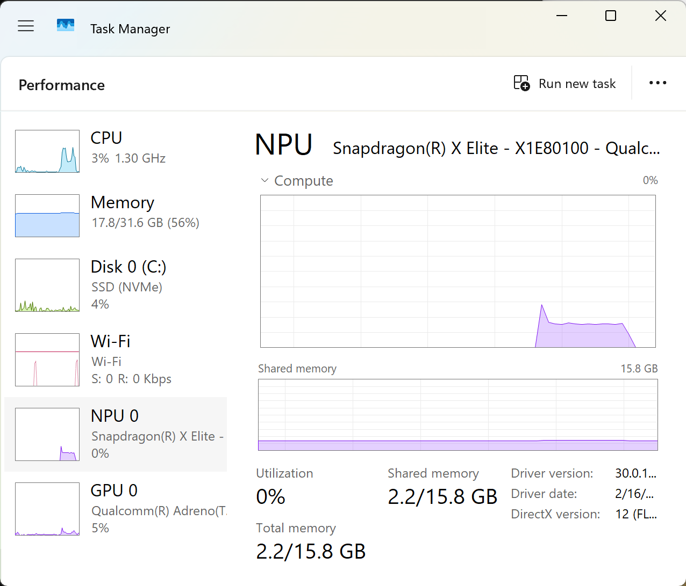

# ChromaKey-AI

## Project Description

**ChromaKey-AI** is an innovative real-time video background processing tool developed as a hackathon project. Our vision is to transform personal video creation by leveraging the powerful on-device AI capabilities of the **Snapdragon® X Elite processor**.

## Team
Yihan Cao, yihancao1001@gmail.com
Yinfei Wang，yw8676@nyu.edu
Kingyu Poon， kp2653@nyu.edu
Siyuan Zhang, jason4huare@gmail.com
Wanqi Huang，wanqihuang@nyu.edu

**Problem Statement:**
In the era of digital content creation, professionals and enthusiasts alike face challenges in achieving clean, professional video backgrounds.
*   **Physical Green Screens:** Traditional methods involve costly, space-consuming, and cumbersome physical green screens and elaborate lighting setups, severely limiting creative flexibility.
*   **Cloud-based AI Solutions:** While convenient, cloud AI services pose significant drawbacks:
    *   **Privacy Risks:** User video streams are uploaded to third-party servers.
    *   **High Latency:** Network transmission and cloud computation introduce noticeable delays.
    *   **Network Dependency:** Unusable without an internet connection.
    *   **Subscription Costs:** Ongoing expenses for service usage.


**Our Vision:**
ChromaKey-AI aims to completely eliminate these pain points. We are building a tool that runs entirely on the local device, requires no physical green screen, offers zero latency, and ensures absolute privacy protection. Our goal is to create an intelligent, secure, and efficient personal virtual studio accessible to everyone.



## Setup Instructions

To set up the project environment and run the application, please follow these steps:

### Prerequisites

*   **Python 3.11 (x64 recommended):** Ensure you have Python 3.11 (64-bit) installed on your system. You can verify your installed versions using `py --list-paths`.
*   **Virtual Environment:** It is highly recommended to use a virtual environment to manage project dependencies.

### Environment Setup

1.  **Create a Virtual Environment:**
    Open your terminal or command prompt in the project root directory (`C:\Users\qc_de\Desktop\edgeai\ChromaKey-AI\`) and create a new virtual environment. We recommend naming it `x64` to reflect the Python version.
    ```bash
    py -3.11 -m venv x64
    ```

2.  **Activate the Virtual Environment:**
    *   **Windows:**
        ```bash
        .\x64\Scripts\activate
        ```

3.  **Install Dependencies:**
    Once the virtual environment is activated, install the necessary Python packages. We use `onnxruntime-qnn` for Snapdragon NPU compatibility (though it may fall back to CPU if NPU is not fully compatible) and `opencv-python` for video processing.
    ```bash
    pip install onnxruntime-qnn opencv-python mediapipe
    ```
    *(Note: `numpy` and other common dependencies will be installed automatically.)*

### Required Files

*   **ONNX Model:** The project uses the `sinet-sinet-float.onnx` model for background segmentation. This model and its associated data file (`model.data`) are expected to be located at `./sinet-sinet-float.onnx/model.onnx/model.onnx` and `./sinet-sinet-float.onnx/model.onnx/model.data` relative to the project root.
*   **Background Images (for `gesture_segmentation_bg_switch.py`):** For the gesture-controlled background switching script, you need to place three image files in the project root directory:
    *   `bg1.jpg`
    *   `bg2.jpg`
    *   `bg3.jpg`
    *(You can use any `.jpg` images you prefer for these.)*

## Running and Usage Instructions

After setting up the environment and placing all required files, you can run the application scripts.

### Basic Background Blur (`step1_capture.py`)

This script provides real-time background blurring. It attempts to use the NPU first and falls back to CPU if NPU acceleration is not fully compatible.

1.  **Activate your virtual environment** (if not already active).
    ```bash
    .\x64\Scripts\activate
    ```
2.  **Run the script:**
    ```bash
    python step1_capture.py
    ```
3.  **Usage:**
    *   A window displaying the real-time video with background blur will appear.
    *   To exit the application, ensure the application window is in focus and press the **'q'** key on your keyboard.

### Gesture-Controlled Background Switching (`gesture_segmentation_bg_switch.py`)

This script extends the background segmentation with hand gesture recognition to dynamically switch backgrounds.

1.  **Activate your virtual environment** (if not already active).
    ```bash
    .\x64\Scripts\activate
    ```
2.  **Ensure background images are in place** (`bg1.jpg`, `bg2.jpg`, `bg3.jpg` in the project root).
3.  **Run the script:**
    ```bash
    python gesture_segmentation_bg_switch.py
    ```
4.  **Usage:**
    *   A window displaying the real-time video with a dynamic background will appear.
    *   Make an "Open Hand" gesture in front of the camera to switch to the next background image.
    *   To exit the application, ensure the application window is in focus and press the **'q'** key on your keyboard.

### Packaging as an Executable

You can package `step1_capture.py` into a standalone `.exe` file for easy distribution.

1.  **Activate your virtual environment** (if not already active).
    ```bash
    .\x64\Scripts\activate
    ```
2.  **Install PyInstaller** (if not already installed):
    ```bash
    pip install pyinstaller
    ```
3.  **Run the packaging command:**
    ```bash
    pyinstaller --onefile --noconsole --add-data "sinet-sinet-float.onnx/model.onnx/model.onnx;." --add-data "sinet-sinet-float.onnx/model.onnx/model.data;." step1_capture.py
    ```
    *(Note: The `--add-data` paths assume you run this command from the project root. The `.` in the destination means the files will be placed in the root of the packaged executable's temporary directory.)*
4.  **Find the Executable:** The generated `.exe` file will be located in the `dist` folder within your project directory.

## License

This project is licensed under the **MIT License**. See the `LICENSE` file for more details.